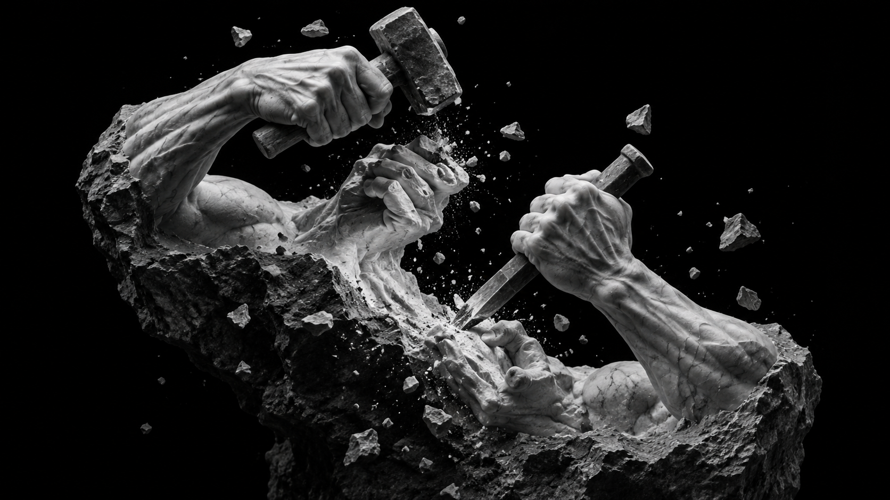

<div align="center">

# ИСКУССТВО СОЗИДАТЬ

[](https://creation.daniilproduction.com/ru/)
[](https://t.me/DaniilProduction)
[](https://github.com/Vancore/creation/actions/workflows/health-check.yml)

<br/>

**[English](README.md)** • **[Русский](README.ru.md)**

<br/>



<br/>

> *«Всё, что тебя окружает и что ты называешь жизнью, было создано людьми, которые были ничуть не умнее тебя. Ты можешь изменить этот мир, ты можешь влиять на него, ты можешь создать вещи, которыми будут пользоваться другие»*  
> — **Стив Джобс**

</div>

---

### 📖 О проекте

Нам долго внушали, что цивилизация держится на жесткой кастовой системе: одинокие визионеры, видящие горизонт, на вершине — и армия узких исполнителей-винтиков у основания.

**Эта иерархия — фундаментальная иллюзия.**

Физическая Вселенная не знает должностей и званий. Она представляет собой нейтральный фундамент, перед лицом которого любой разум обладает равным онтологическим весом. Сегодня, когда генеративный искусственный интеллект сжал дистанцию между чистой мыслью и ее материальным воплощением до нуля, старая кастовая система рушится окончательно.

**«Искусство созидать»** — интерактивное философское эссе о тяжести подлинной свободы, аскезе вкуса в эпоху синтетического шума и великой физике синтеза: о том, как два суверенных создателя способны победить собственное эго и построить мост над бездной.

Это прямое продолжение и смысловое завершение эссе *«Искусство разделять»*.

> **Нож дал нам власть над формой. Мост возвращает нам жизнь.**

---

### 📑 Оглавление

1. **Иллюзия двух каст** — Почему во Вселенной нет должностей и почему перед её нейтральным фундаментом любой разум изначально равен.
2. **Рекурсия орудий** — Цивилизация как открытый исходный код: от первого кремниевого рубила до бескорыстного подвига Григория Перельмана.
3. **Тяжесть свободы** — Почему люди бегут в комфорт клетки и в чем заключается цена встречи с леденящей тишиной чистого листа.
4. **Аскеза вкуса** — Эпоха всесильного ИИ, исчезновение физического барьера сложности и беспощадная дисциплина отсечения 999 пустых вариантов.
5. **Коридор зеркал** — Преодоление цифрового солипсизма: как союзы Джобса и Айва, Леннона и Маккартни доказали возможность сверхчеловеческого соавторства.
6. **Вторая эпоха** — Вдох и выдох разума: великий синтез ножа и моста.

---

### ⚡ Архитектура и технологии

* **Чистый веб (Zero Dependencies):** Никаких тяжелых фреймворков, компиляторов и сторонних библиотек — только семантический HTML5, чистый CSS3 и нативный JavaScript.
* **Атмосферный саундтрек из 4 треков:** Встроенный кастомный аудиоплеер с непрерывной 10-минутной сюитой от композитора *leberch* (*Science Documentary*, *Atmosphere Documentary*, *Documentary*, *Ambient*), синхронизированной со временем чтения.
* **Оптимизация медиа:** Все художественные иллюстрации конвертированы в формат WebP с прецизионной компрессией без визуальных потерь.
* **Фокус на чтении:** Плавный индикатор прогресса прокрутки, выдвижное оглавление и адаптивное управление аудио.
* **Поисковая оптимизация и стандарты (SEO):**
  * Строгая многоязычность через двусторонние теги `hreflang` и `canonical`.
  * Семантическая микроразметка `Schema.org/Article` (JSON-LD).
  * Карточки OpenGraph и Twitter Summary Large Image для красивых превью в Telegram, X и социальных сетях.
* **Инфраструктура:** Статический хостинг на GitHub Pages с привязкой собственного поддомена и автоматическим health-check мониторингом доступности через GitHub Actions.

---

### 📁 Структура репозитория

```text
├── .github/
│   └── workflows/
│       └── health-check.yml # Автоматический мониторинг доступности сайта
├── audio/              # Саундтрек для чтения (4 трека от leberch в MP3)
├── img/                # Иллюстрации к главам (1–6), icon.svg и превью 1.png
├── ru/
│   └── index.html      # Русская версия страницы (/ru/)
├── .nojekyll           # Отключение сборщика Jekyll на GitHub Pages
├── CNAME               # Конфигурация поддомена (creation.daniilproduction.com)
├── index.html          # Английская версия страницы (Корень /)
├── README.md           # Документация на английском языке
├── README.ru.md        # Документация на русском языке
├── robots.txt          # Инструкции для поисковых краулеров
├── script.js           # Логика скролл-бара, боковых панелей и аудиоплеера
├── sitemap.xml         # Карта сайта для поисковых систем
└── style.css           # Стили, типографика и тема оформления
```

---

### 🛠️ Локальный запуск

Сайт полностью статичен и не требует установки зависимостей:

```bash
# Клонировать репозиторий
git clone https://github.com/Vancore/creation.git
cd creation

# Запуск через встроенный веб-сервер Python 3
python3 -m http.server 8080

# Или с помощью Node.js
npx serve .
```

Откройте адрес `http://localhost:8080` в вашем браузере.

---

### 🚀 Проекты и разработки

Все новые эссе, технологические релизы и проекты публикуются в Telegram-канале:  
👉 **[@DaniilProduction](https://t.me/DaniilProduction)**